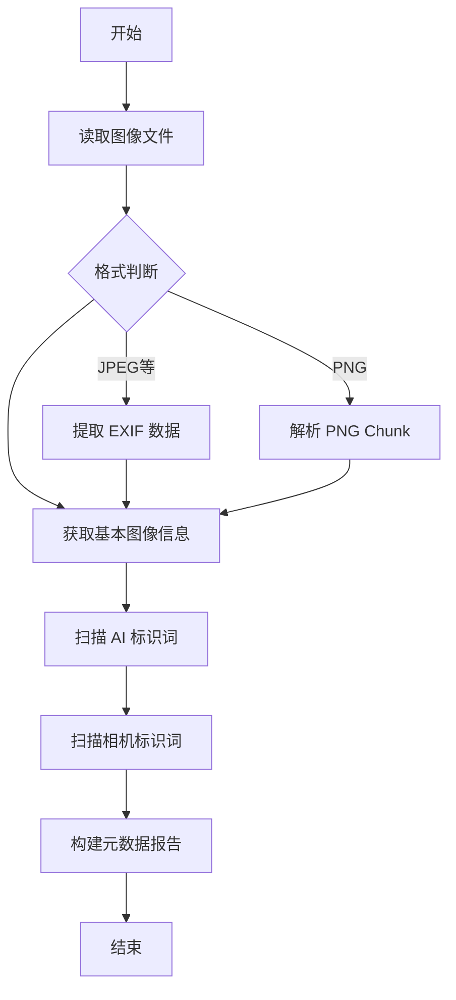
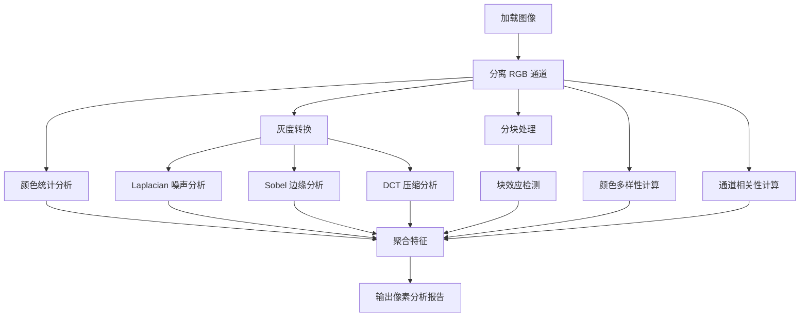
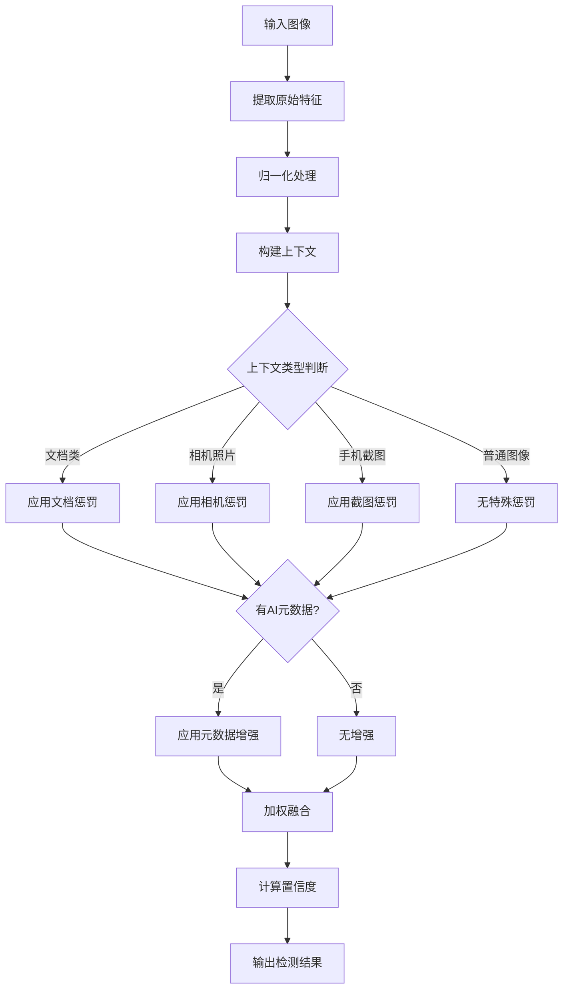
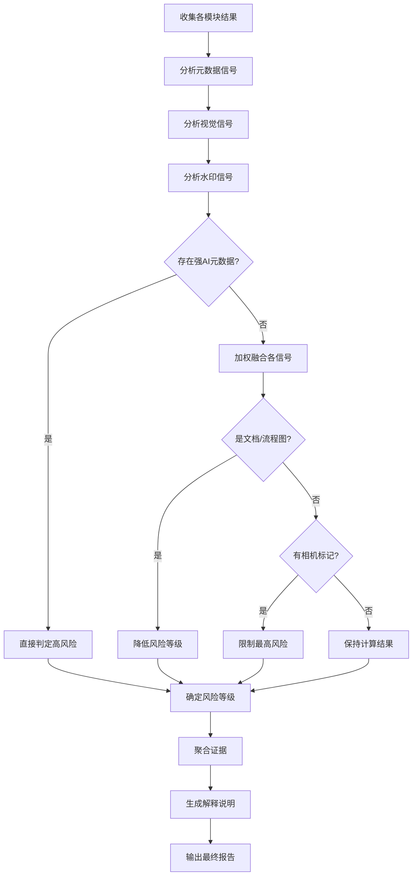

# AI 图像检测工具系统架构文档

## 1. 设计背景与目标

### 1.1 问题背景
随着 AI 生成图像技术的快速发展，AI 生成图像与真实照片的区分难度日益增加。在实际应用场景中，需要一种综合、可靠的方法来鉴定图像来源，包括：
- 元数据完整性与真实性验证
- 视觉特征异常检测
- 隐写与水印分析
- 对象与场景一致性检查

### 1.2 系统目标
设计一个多维度的 AI 图像检测系统，通过整合多种分析维度，提供全面、可解释的检测结果，而不是依赖单一的判断依据。系统需要：
- 支持实时分析与批量处理
- 提供可解释性的检测依据
- 具备扩展性，可接入新的检测算法
- 输出标准化的风险评估报告

## 2. 核心算法/处理逻辑详解

### 2.1 算法：元数据提取与 AI 标识检测

#### 输入输出
- **输入**：图像文件路径
- **输出**：包含 EXIF 信息、PNG Chunk 信息、AI 生成标识检测结果的完整元数据包

#### 算法步骤说明
1. **读取图像基本信息**：使用 PIL 库获取图像格式、尺寸、通道数等基础信息
2. **EXIF 数据解析**：使用 exifread 库提取照片元数据，包括相机型号、拍摄参数等
3. **PNG Chunk 解析**：对于 PNG 格式，直接解析二进制结构，提取文本块、压缩块等信息
4. **AI 生成标识检测**：
   - 扫描 EXIF 关键字段（如 Software、Model、注释等）
   - 匹配预定义的 AI 生成器特征词（如 Midjourney、Stable Diffusion、DALL-E 等）
   - 检查 PNG 文本块中的生成参数（如 prompt、steps、seed、sampler 等）
5. **相机标识检测**：匹配常见相机厂商与型号名称，作为负向证据

#### 设计理由
- 元数据是最直接的判别依据，若明确存在 AI 生成标识，可作为强证据
- 采用关键字匹配而非复杂语义分析，保持鲁棒性与高效性
- 同时检查 EXIF 与 PNG Chunk，覆盖主流图像格式的元数据存储方式

#### Mermaid 流程图


#### 关键特性
- **时间复杂度**：O(n)，n 为图像文件大小
- **边界条件**：
  - 无 EXIF 数据的图像 → 正常处理，标识未发现
  - 损坏的 PNG 文件 → 返回错误信息
  - 超大图像 → 只解析元数据头部，避免全量读取
- **错误处理**：采用 try-catch 包装各解析步骤，保证某一步失败不影响整体流程

#### 输入输出示例
```
输入：一张由 Stable Diffusion 生成并保存为 PNG 的图片

输出：
{
  "exif": { ... },
  "png_chunks": {
    "tEXt": {
      "keyword": "parameters",
      "text": "a beautiful landscape, Stable Diffusion XL, steps: 30, CFG: 7.5"
    }
  },
  "ai_indicators": ["PNG文本包含生成参数或生成器标识"]
}
```

---

### 2.2 算法：像素级特征分析

#### 输入输出
- **输入**：图像文件路径
- **输出**：颜色分布、噪声特征、熵值、块效应、压缩伪影等像素级特征

#### 算法步骤说明
1. **颜色通道统计**：分别计算 RGB 三通道的均值、标准差、偏度、峰度
2. **噪声特征分析**：
   - 使用 Laplacian 算子计算边缘方差
   - 计算 Sobel 边缘强度标准差
   - 估计噪声与信号比值
3. **熵值计算**：对每个颜色通道计算香农熵，反映信息丰富度
4. **块效应检测**：将图像分块，计算块内方差均值，检测压缩块效应
5. **像素模式分析**：
   - 统计唯一颜色数量，计算颜色多样性
   - 计算 RGB 通道间相关性
6. **压缩伪影分析**：使用 DCT 变换分析高频能量分布

#### 设计理由
- AI 生成图像通常具有不同的噪声分布模式（如过度平滑）
- 熵值差异可反映生成模型与真实照片的信息结构差异
- 块效应检测可发现 JPEG 压缩的异常模式
- 多通道相关性是自然图像与生成图像的重要区别

#### Mermaid 流程图


#### 关键特性
- **时间复杂度**：O(w*h)，与图像像素数线性相关
- **边界条件**：单色图像、极小图像（如 10x10）→ 采用降级处理
- **可扩展性**：特征模块可独立添加或移除
- **错误处理**：数值计算异常时返回默认值

#### 输入输出示例
```
输入：一张风景照片

输出：
{
  "color_distribution": {
    "red": {"mean": 128.5, "std": 56.2, ...},
    "green": ...,
    "blue": ...
  },
  "noise_analysis": {
    "laplacian_variance": 152.3,
    "is_high_noise": false
  },
  "entropy": {"mean_entropy": 6.8},
  "blockiness": {"blockiness_score": 85.6},
  ...
}
```

---

### 2.3 算法：多特征融合 AI 检测（核心算法）

#### 输入输出
- **输入**：图像文件路径、元数据标识列表、上下文信息
- **输出**：AI 概率、置信度、归一化特征、分类结果

#### 算法步骤说明
1. **特征提取**：
   - 计算颜色熵值
   - 分析噪声模式（Laplacian 方差）
   - 评估边缘质量（Canny 密度 + Sobel 标准差）
   - 检测颜色异常性（RGB 差异均值）
   - 分析纹理特征（Gabor 滤波响应标准差）
   - 计算块效应（8x8 块方差均值）
2. **特征归一化**：
   - 对连续特征采用 log 归一化，将非线性关系线性化
   - 对元数据特征采用二值归一化
3. **上下文构建**：
   - 判断是否为文档/流程图（低熵值 + 低颜色多样性 + 高通道相关性）
   - 判断是否为相机照片（存在相机元数据）
   - 判断是否为手机截图（特定分辨率比例 + 常见手机尺寸）
4. **加权评分**：
   - 各特征按预设权重加权求和
   - 应用上下文惩罚项（文档类 -28%，相机类 -12%，截图类 -18%）
   - 应用元数据增强项（强元数据 +25%）
5. **置信度计算**：统计活跃特征数（值 > 0.3）占比

#### 设计理由
- **多特征融合**：避免单一特征失效导致误判
- **加权策略**：通过权重平衡不同特征的重要性
- **上下文修正**：考虑图像类型对检测结果的影响（文档、截图等通常视觉特征异常但并非 AI 生成）
- **元数据优先级**：若存在明确的 AI 元数据，显著提升判定结果

#### Mermaid 流程图


#### 关键特性
- **时间复杂度**：O(w*h)，主要开销在特征提取
- **权重配置**：可配置的权重字典，便于调优
- **边界条件**：
  - 单色图像 → 熵值与颜色异常性特征降权
  - 极小图像 → 块效应检测跳过
  - 无上下文信息 → 采用默认假设
- **错误处理**：单特征计算失败时返回 0.0，保持整体流程不中断

#### 输入输出示例
```
输入：一张 AI 生成的风景照

输出：
{
  "ai_probability": 0.88,
  "confidence": 0.75,
  "is_likely_ai": true,
  "normalized_features": {
    "color_entropy": 0.52,
    "noise_level": 0.38,
    "blockiness": 0.45,
    ...
  },
  "metadata_indicators": [...]
}
```

#### 为什么是这个算法而不是其他？
| 对比项 | 本系统算法 | 纯深度学习模型 | 单一特征检测 |
|--------|-----------|---------------|-------------|
| 可解释性 | 高，每个特征都有明确含义 | 低，黑盒模型 | 中，特征明确但信息有限 |
| 鲁棒性 | 高，多特征冗余设计 | 中，对对抗攻击敏感 | 低，易被针对性规避 |
| 计算资源 | 中等，CPU 可处理 | 高，需 GPU 加速 | 低，快速但不可靠 |
| 元数据利用 | 充分，强元数据优先级高 | 通常不利用 | 不利用 |
| 上下文处理 | 有，考虑图像类型 | 通常无 | 无 |

---

### 2.4 算法：对象检测与场景分析

#### 输入输出
- **输入**：图像文件路径、置信度阈值
- **输出**：检测到的对象列表、类别统计、场景描述

#### 算法步骤说明
1. **加载 YOLOv8 模型**：使用预训练的 YOLOv8n 模型（nano 版本，速度优先）
2. **运行目标检测**：对输入图像执行前向推理
3. **解析检测结果**：
   - 提取类别名称、置信度、边界框坐标
   - 按置信度阈值过滤结果
4. **统计与场景推断**：
   - 统计各类别出现次数
   - 基于常见类别组合生成场景描述

#### 设计理由
- YOLOv8 是目标检测领域的前沿模型，精度与速度平衡良好
- 提供场景上下文信息，辅助人工复核
- 可进一步扩展用于检测 AI 生成图像中的对象不一致问题

#### 关键特性
- **模型大小**：YOLOv8n 约 6MB，加载快速
- **检测速度**：在普通 CPU 上可实时处理
- **错误处理**：模型加载失败时返回空检测列表

---

### 2.5 算法：隐写与水印检测

#### 输入输出
- **输入**：图像文件路径
- **输出**：LSB 分析、奇偶性分析、文件大小异常、DCT 系数分析结果

#### 算法步骤说明
1. **最低有效位（LSB）分析**：
   - 提取 RGB 三通道的最低位平面
   - 计算 LSB 平面的熵值，检测是否存在隐藏信息
2. **LSB 奇偶性分析**：检查 0/1 分布是否接近理想随机（50%）
3. **文件大小异常检测**：比较实际大小与预期原始大小的压缩比
4. **DCT 系数分析**：分析 8x8 块的高频能量，检测隐写痕迹
5. **综合评分**：统计可疑测试数量，计算整体置信度

#### 设计理由
- AI 生成图像可能包含模型内置的不可见水印
- LSB 是最常见的隐写方法
- 多维度检测提高可靠性

#### 关键特性
- **误报处理**：采用保守策略，需多项测试同时异常才判定可疑
- **时间复杂度**：O(w*h)，与像素数线性相关

---

### 2.6 算法：风险评估与综合决策

#### 输入输出
- **输入**：AI 检测结果、元数据、像素分析、隐写检测
- **输出**：风险等级（高/中/低/未知）、综合得分、证据摘要、解释说明

#### 算法步骤说明
1. **信号分类**：分别分析元数据信号、视觉信号、水印信号
2. **加权计分**：
   - AI 概率：权重 60%
   - 元数据信号：权重 25%
   - 视觉信号：权重 10%
   - 水印信号：权重 5%
3. **规则修正**：
   - 若存在强 AI 元数据 → 强制高风险
   - 若为文档/流程图且无强元数据 → 强制低风险
   - 若存在相机标记且无强元数据 → 限制最高风险
4. **边界保障**：设置各概率区间的最低得分保障
5. **风险定级**：基于最终得分确定风险等级
6. **证据聚合**：收集各类证据，生成可解释性摘要
7. **解释生成**：构建结构化的风险解释文档

#### 设计理由
- **分层决策**：强证据（元数据）优先，弱证据（视觉）为辅
- **权重倾斜**：AI 检测概率作为主要依据，但元数据可 override
- **反证处理**：文档/相机标记等作为反证，降低误报
- **可解释性**：每一项决策都有对应的证据支撑

#### Mermaid 流程图


#### 关键特性
- **时间复杂度**：O(1)，纯规则与计算
- **边界条件**：
  - 无 AI 检测结果 → 风险等级 unknown
  - 无元数据 → 忽略元数据信号
  - 综合得分越界 → 钳制在 0-100 区间
- **错误处理**：各信号源分析失败时使用默认值

#### 输入输出示例
```
输入：
{
  "ai_detection": {"ai_probability": 0.85, "confidence": 0.7},
  "metadata": {"ai_indicators": [...]},
  "pixel_analysis": {...},
  "steg_detection": {...}
}

输出：
{
  "level": "high",
  "score": 88.5,
  "summary": "综合风险分 88.50，存在明确生成元数据",
  "evidence_summary": ["元数据命中 2 条生成器线索", ...],
  "explanation": {...}
}
```

## 3. 架构风格与模块划分

### 3.1 整体架构风格
系统采用**分层架构**与**模块化设计**，主要分为：
- API 层：负责 HTTP 接口与命令行入口
- 服务层：协调各模块工作流，整合结果
- 模块层：独立的功能模块（元数据、像素分析、AI 检测等）
- 领域层：核心数据模型与业务实体
- 基础设施层：数据存储与模型加载

### 3.2 模块职责划分

| 模块 | 主要职责 | 对应文件 |
|------|---------|---------|
| MetadataExtractor | 元数据解析与 AI 标识检测 | `modules/metadata_extractor.py` |
| PixelAnalyzer | 像素级特征分析 | `modules/pixel_analyzer.py` |
| AIDetector | 多特征融合 AI 检测 | `modules/ai_detector.py` |
| ObjectDetector | 基于 YOLOv8 的对象检测 | `modules/object_detector.py` |
| StegDetector | 隐写与水印检测 | `modules/steg_detector.py` |
| MLClassifier | 机器学习分类器（逻辑回归） | `modules/ml_classifier.py` |
| AnalysisService | 分析流程协调与风险评估 | `services/analysis_service.py` |
| ExportService | 报告导出服务 | `services/export_service.py` |

### 3.3 数据流转
```
图像输入
  ↓
[MetadataExtractor] ──→ 元数据报告
  ↓                          ↓
[PixelAnalyzer] ──────→ 像素特征报告
  ↓                          ↓
[AIDetector] ────────→ AI 检测结果
  ↓                          ↓
[StegDetector] ──────→ 隐写检测结果
  ↓                          ↓
[AnalysisService] ←──────────┘
  ↓
风险评估报告
  ↓
[ExportService]
  ↓
Markdown/JSON/纯文本报告
```

## 4. 关键技术决策

### 4.1 算法选型对比

#### 元数据解析：exifread + 手动 PNG Chunk 解析 vs 其他库
- **选择方案**：exifread + 手动 PNG 解析
- **理由**：
  - exifread 纯 Python 实现，无需系统依赖
  - 手动 PNG 解析可精准控制，提取特定 Chunk 内容
  - 备选方案（如 Pillow 的 EXIF 支持）功能有限

#### AI 检测：多特征融合启发式 vs 深度学习
- **选择方案**：多特征融合启发式算法
- **理由**：
  - 可解释性强，便于业务理解与调试
  - 无需 GPU，部署成本低
  - 对新型生成器适应性较好，可快速添加新特征
  - 可结合元数据，这是深度学习模型通常忽略的强证据

#### 对象检测：YOLOv8n vs 其他模型
- **选择方案**：YOLOv8n（nano 版本）
- **理由**：
  - 速度与精度平衡良好
  - 模型体积小（~6MB），加载快速
  - 社区支持好，持续更新

#### 机器学习模型：逻辑回归 vs 复杂模型
- **选择方案**：逻辑回归
- **理由**：
  - 简单且可解释
  - 对数据量要求较低
  - 作为启发式算法的可选增强，而非替代

### 4.2 设计约束与权衡

| 决策项 | 选择 | 理由 | 代价 |
|-------|------|------|------|
| 图像加载 | PIL + OpenCV 混用 | 各有所长：PIL 方便元数据，OpenCV 擅长图像处理 | 增加依赖数量 |
| 特征归一化 | Log 归一化 | 符合特征分布特点 | 需要调优归一化参数 |
| 权重配置 | 硬编码 | 部署简单，避免配置管理复杂度 | 调优需重新部署 |
| 报告格式 | Markdown + JSON | 兼顾可读性与机器处理 | 需要维护多套导出逻辑 |
| 存储方案 | 文件系统 JSON | 简单易部署，无外部依赖 | 不适合大规模数据 |

### 4.3 扩展性设计
- 模块通过工厂模式加载，便于替换实现
- 特征权重通过字典配置，支持动态调整
- 机器学习模型可选加载，不影响核心流程
- 新增检测模块只需实现统一接口

## 5. 运行与部署

### 5.1 资源需求
- **CPU**：最低 2 核，推荐 4 核以上
- **内存**：最低 2GB，推荐 4GB 以上
- **存储**：至少 50MB 可用空间（含模型文件）
- **GPU**：非必需，可加速 YOLOv8 检测（可选）

### 5.2 依赖组件
- Python 3.8+
- Pillow, OpenCV, NumPy, SciPy
- Ultralytics YOLO
- exifread, piexif

### 5.3 部署模式
1. **Web 服务模式**：通过 Flask 提供 HTTP API
2. **命令行模式**：使用 CLI 工具直接处理图像
3. **Python 库模式**：作为模块嵌入其他应用

### 5.4 性能特性
- 单张图像分析（全模式）：约 0.5-2 秒（取决于图像尺寸）
- 主要耗时：像素特征分析、YOLOv8 检测
- 批量处理：可并行处理，无状态设计

### 5.5 监控与维护
- 关键指标：处理时长、错误率、各模块性能
- 日志记录：分析历史、错误日志、性能数据
- 数据存储：历史记录保存为 JSON 文件，便于回溯
